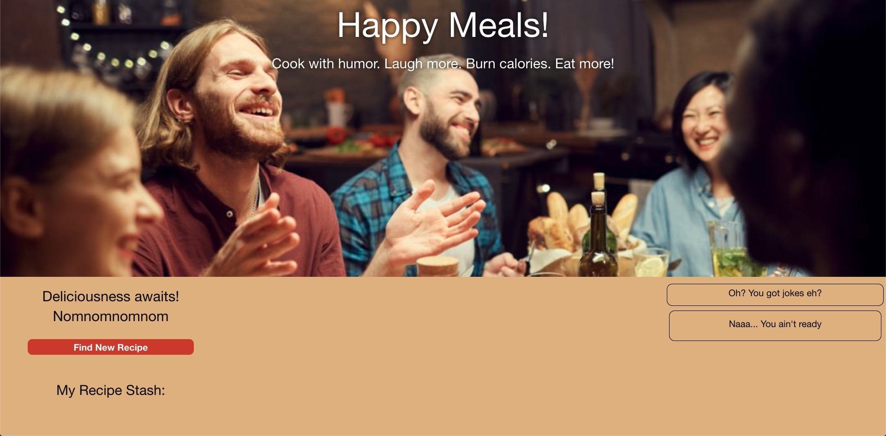
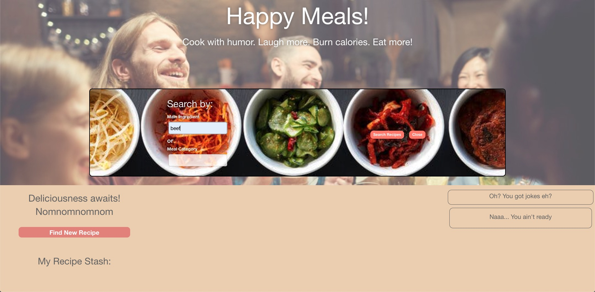
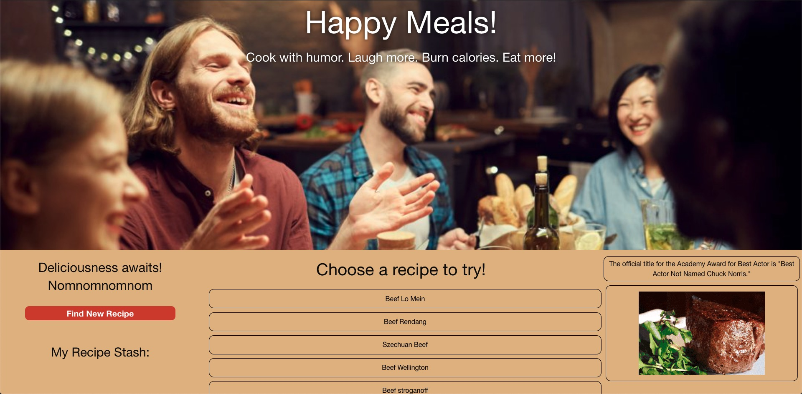
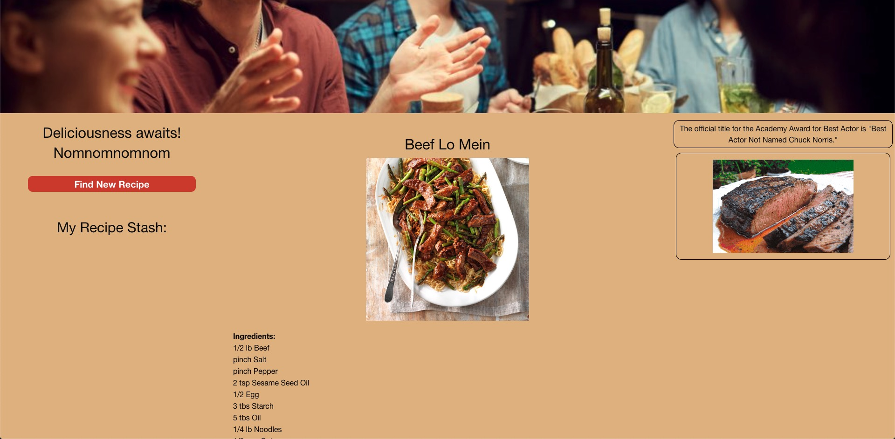
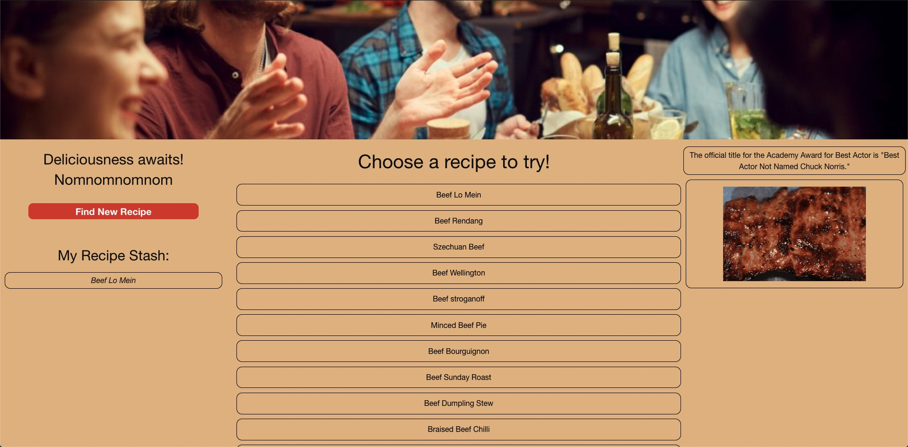

# Happy Meals

## Purpose
An application that provides recipes and a good laugh
User will input a main ingredient of their choosing and a list will populate recipes that feature that ingredient. A random joke will be displayed upon choosing the desired recipe.

## User Story
As a hungry person, I want cooking to not be a chore. I want to type in an ingredient and get recipes based on that ingredient all while getting a laugh.

## Built With
* HTML
* CSS
* JavaScript
* Foundation

## Website
https://jmol721.github.io/get-you-a-happy-meal-toy-not-included/

## Snapshot

## Criteria
* WHEN the user searches for an ingredient THEN they are presented with a list of recipes that include that ingredient
* WHEN the users clicks on the desired recipe THEN they get a list of ingredients and the instructions 
* WHEN a recipe is clicked THEN some humor is provided 
* WHEN the user finds a recipe they truly like THEN they can add it to a recipe stash

## Contribution
Made by Angela Man, Jose Molina, and Hector Rangel